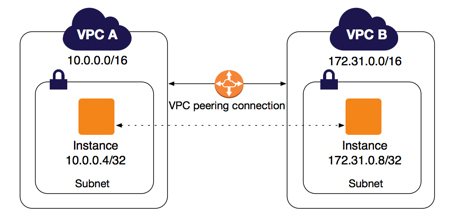
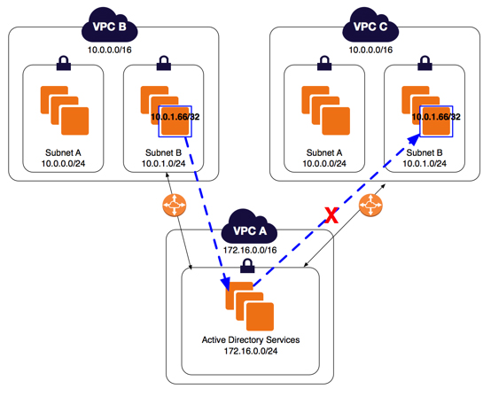
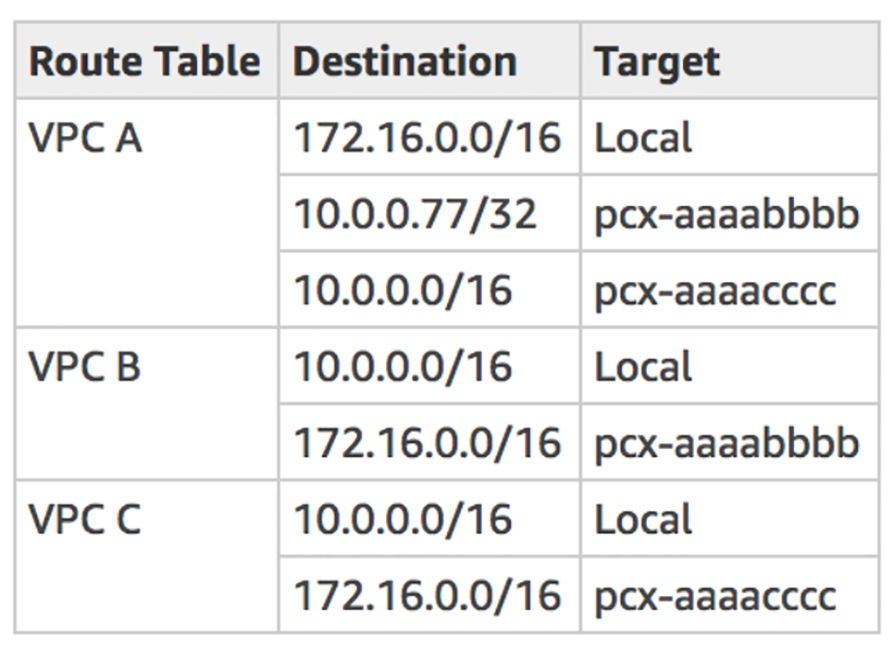

# Longest Prefix Match: Understanding Advanced Concepts in VPC Peering

### VPC Peering Basics

In AWS, a Virtual Private Cloud (VPC) peering connection is a networking  connection between two VPCs which allows you to route specific traffic  between them using either private IPv4 addresses or IPv6 addresses.

A VPC peering connection can be created between your own VPCs, or  alternatively, a VPC in another AWS account. You can also create an  inter-region VPC peering connection where the VPCs are located in  different AWS Regions. Amazon EC2 Instances in either VPC can  communicate with each other freely as if they are within the same  network.

One example of VPC Peering  is the integration of third-party services to your AWS account. Say you  want to utilize a cloud database service from an external provider, like MongoDB Atlas which provides AWS, GCP, and Azure-backed clusters. In  order for your EC2 instances to communicate with your external MongoDB  cluster, you need to establish a VPC Peering connection to the MongoDB  Atlas VPC first.

There are various VPC Peering setups that you can put up such as  configurations with ClassicLink, configurations with routes to an entire CIDR block (VPCs don’t have subnets) and lastly, configurations with **specific** routes (VPCs have two or more subnets). This article will focus on the latter  type in which your VPC has peered with 2 VPCs and configured with  specific routes on their route table, leveraging on the *longest prefix match* algorithm.

## Longest Prefix Match — what is it?

As an overview, let say that you have a central VPC (*labeled as VPC A below)* with one subnet. This has a VPC peering connection between VPC A and VPC B (`pcx-aaaabbbb`) and also between VPC A and VPC C (`pcx-aaaacccc`).

The key point of this scenario is: Both VPC B and VPC C have **matching** CIDR blocks of `10.0.0.0/16` as shown in the diagram below:

At this point, if there is incoming traffic from VPC A which is intended  to 10.0.0.66, which VPC will it go to? Will it be VPC B or VPC C,  considering that these two VPCs have exactly the same prefix (CIDR  block)? What’s your guess?

This scenario is an advanced topic regarding VPC Peering where you have one VPC Peered with 2 VPCs where it uses *Longest Prefix Match* for directing traffic based on your route table configuration. Let’s go  over the basics first in order for us to better understand this  scenario:

The term “longest prefix match” is basically an algorithm used by routers  in Internet Protocol (IP) networking used for choosing an entry from a  forwarding route table. It is possible that each entry in a forwarding  table may specify a **sub-network** in which  one destination address may match more than one forwarding table entry.  In this case, 10.0.0.0/24 is a sub-network of 10.0.0.0/16 CIDR block. At this point, the “**longest** prefix” actually refers to the one with the **longest** subnet mask which is the most specific of the matching table entries where the traffic will be forwarded.

Now that we get the context of “Longest Prefix Match”, we can now better  understand how this works. Each VPC has a CIDR Block of 10.0.0.0/16 with two subnets: 10.0.0.0/24 (Subnet A) and 10.0.1.0/24 (Subnet C).

Adding an entry of **10.0.0.0/24** to pcx-aaaabbbb on your route table is the actual implementation of the  prefix match we discussed earlier. Since 10.0.0.0/24 is a sub-network  (Subnet A)of 10.0.0.0/16, we can better control the flow of traffic. The CIDR block of 10.0.0.0/24 has a total of 256 IP address with a range  starting from 10.0.0.0 to 10.0.0.255 address.

The same goes for Subnet B which has a CIDR block of 10.0.1.0/24. Since its prefix is the same with Subnet A, it also has a total of 256 IP address with a range starting from 10.0.**1**.0 to 10.0.**1**.255 address.

Remember that the IP address in the question is 10.0.0.66 which is within the  range of the 10.0.0.0/24 sub-network (Subnet A). Since we have a  specific entry to pcx-aaaabbbb for this, the router’s behavior will  forward the traffic to VPC B.

In your workplace, it’s good to have a thorough knowledge of VPC  Networking especially if your VPC is utilizing third-party cloud  services. You should know more about these advanced VPC Peering concepts especially if you are preparing for your AWS Solutions Architect  Professional (SAP-C01) or AWS Certified Advanced Networking (ANS-C00)  certification:

