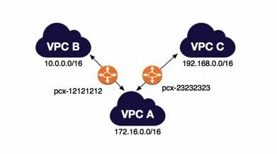

# VPC Peering

- A networking connection between **two VPCs** that enables you to route traffic between them privately using private  IPv4 addresses or IPv6 addresses. Instances in either VPC can  communicate with each other as if they are within the same network.
- You can create a VPC peering connection between your own VPCs, with a VPC  in another AWS account, or with a VPC in a different AWS Region (also  called **Inter-Region VPC Peering**).
- A VPC peering connection is neither a gateway nor a AWS Site-to-Site VPN  connection, and does not rely on a separate piece of physical hardware.  There is no single point of failure for communication or a bandwidth  bottleneck.
- VPC Peering does **NOT support edge-to-edge routing**. You can create multiple VPC peering connections for each VPC that you  own, but transitive peering relationships are not supported.
  - In the following diagram, VPC B is not peered with VPC C.

## Establishing A Peering Connection

- The owner of the *requester* VPC sends a request to the owner of the accepter VPC to create the VPC peering connection. The *accepter* VPC cannot have a CIDR block that overlaps with the requester VPC’s CIDR block.
- To enable the flow of traffic between the VPCs using private IP addresses, the owner of each VPC in the VPC peering connection must manually add a route to one or more of their VPC route tables that points to the IP  address range of the other VPC (the peer VPC).
- Update the security group rules that are associated with your instance to  ensure that traffic to and from the peer VPC is not restricted.
- By default, if instances on either side of a VPC peering connection  address each other using a public DNS hostname, the hostname resolves to the instance’s public IP address. To change this behavior, enable DNS  hostname resolution for your VPC connection. This will allow the DNS  hostname to resolve to the instance’s private IP address.

## Limitations

- You cannot create a VPC peering connection between VPCs that have matching or overlapping IPv4 or IPv6 CIDR blocks.
- You cannot have more than one VPC peering connection between the same two VPCs at the same time.
- **Unicast reverse path forwarding** in VPC peering connections is not supported.
- If the VPCs are in the same region, you can enable the resources on either side of a VPC peering connection to communicate with each other over  IPv6.
- For inter-region peering, you cannot create a security group rule that  references a peer VPC security group. Communication over IPv6 is not  supported as well.

For those preparing for the AWS Certified Solutions Architect Professional exam, it’s a must to read this article as well: [**Longest Prefix Match: Understanding Advanced Concepts in VPC Peering**](longest-prefix-match-understanding-advanced-concepts-in-vpc-peering.md)

Sources:
 https://docs.aws.amazon.com/vpc/latest/userguide/vpc-peering.html
 https://docs.aws.amazon.com/vpc/latest/peering/what-is-vpc-peering.html