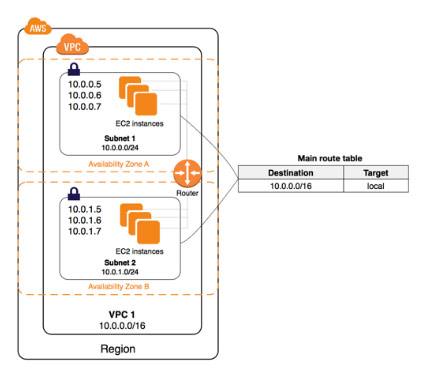

# Amazon VPC

- Create a virtual network in the cloud dedicated to your AWS account where you can launch AWS resources
- Amazon VPC is the networking layer of Amazon EC2
- A VPC spans all the Availability Zones in the region. After creating a  VPC, you can add one or more subnets in each Availability Zone.

### **Key Concepts**

- A **virtual private cloud** (VPC) allows you to specify an IP address range for the VPC, add  subnets, associate security groups, and configure route tables.
- A **subnet** is a range of IP addresses in your VPC. You can launch AWS resources into a specified subnet. Use a **public subnet** for resources that must be connected to the internet, and a **private subnet** for resources that won’t be connected to the internet.
- To protect the AWS resources in each subnet, use **security groups** and **network access control lists (ACL)**.
- Expand your VPC by adding secondary IP ranges.

### **EC2-VPC vs EC2-Classic**

### **Default vs Non-Default VPC**

### **A diagram of default VPC**

### **A diagram of non-default VPC**

### **Accessing a Corporate or Home Network**

- - You can optionally connect your VPC to your own corporate data center using an **IPsec AWS managed VPN connection**, making the AWS Cloud an extension of your data center.
  - A **VPN connection** consists of:
    - a **virtual private gateway** (which is the VPN concentrator on the Amazon side of the VPN connection) attached to your VPC.
    - a **customer gateway** (which is a physical device or software appliance on your side of the VPN connection) located in your data center.
    - A diagram of the connection

- - **AWS Site-to-Site Virtual Private Network** (VPN) connections can be moved from a virtual private gateway to an **AWS Transit Gateway** without having to make any changes on your customer gateway. Transit  Gateways enable you to easily scale connectivity across thousands of  Amazon VPCs, AWS accounts, and on-premises networks.
  - **AWS PrivateLink** enables you to privately connect your VPC to supported AWS services,  services hosted by other AWS accounts (VPC endpoint services), and  supported AWS Marketplace partner services. You do not require an  internet gateway, NAT device, public IP address, AWS Direct Connect  connection, or VPN connection to communicate with the service. Traffic  between your VPC and the service does not leave the Amazon network.
  - AWS PrivateLink-Supported Services:

- - You can create a **VPC peering connection** between your VPCs, or with a VPC in another AWS account, and enable  routing of traffic between the VPCs using private IP addresses. You  cannot create a VPC peering connection between VPCs that have  overlapping CIDR blocks.
  - Applications in an Amazon VPC can securely access AWS PrivateLink endpoints across  VPC peering connections. The support of VPC peering by AWS PrivateLink  makes it possible for customers to privately connect to a service even  if that service’s endpoint resides in a different Amazon VPC that is  connected using VPC peering. 
  - AWS PrivateLink endpoints can now be accessed across both intra- and inter-region VPC peering connections.

### **VPC Use Case Scenarios**

- VPC with a Single Public Subnet
- VPC with Public and Private Subnets (NAT)
- VPC with Public and Private Subnets and AWS Managed VPN Access
- VPC with a Private Subnet Only and AWS Managed VPN Access

### **Subnets**

- When you create a VPC, you must specify a range of IPv4 addresses for the  VPC in the form of a Classless Inter-Domain Routing (CIDR) block  (example: 10.0.0.0/16). This is the **primary CIDR block** for your VPC. 
- You can add one or more subnets in each Availability Zone of your VPC’s region. 
- You specify the CIDR block for a subnet, which is a subset of the VPC CIDR block.
- A CIDR block must not overlap with any existing CIDR block that’s associated with the VPC.
- Types of Subnets
  - Public Subnet – has an internet gateway
  - Private Subnet – doesn’t have an internet gateway
  - VPN-only Subnet – has a virtual private gateway instead
- IPv4 CIDR block size should be between a /16 netmask (65,536 IP addresses) and /28 netmask (16 IP addresses).
- The **first four IP addresses and the last IP address in each subnet CIDR block** are **NOT available** for you to use, and cannot be assigned to an instance.
- You cannot increase or decrease the size of an existing CIDR block.
- When you associate a CIDR block with your VPC, a route is automatically  added to your VPC route tables to enable routing within the VPC (the  destination is the CIDR block and the target is *local*).
- You have a limit on the number of CIDR blocks you can associate with a VPC  and the number of routes you can add to a route table.
- The following rules apply when you add IPv4 CIDR blocks to a VPC that’s part of a **VPC peering connection**:
  - If the VPC peering connection is active, you can add CIDR blocks to a VPC  provided they do not overlap with a CIDR block of the peer VPC.
  - If the VPC peering connection is pending-acceptance, the owner of the  requester VPC cannot add any CIDR block to the VPC. Either the owner of  the accepter VPC must accept the peering connection, or the owner of the requester VPC must delete the VPC peering connection request, add the  CIDR block, and then request a new VPC peering connection.
  - If the VPC peering connection is pending-acceptance, the owner of the  accepter VPC can add CIDR blocks to the VPC. If a secondary CIDR block  overlaps with a CIDR block of the requester VPC, the VPC peering  connection request fails and cannot be accepted.
- If you’re using AWS Direct Connect to connect to multiple VPCs through a  direct connect gateway, the VPCs that are associated with the direct  connect gateway must not have overlapping CIDR blocks.
- The CIDR block is ready for you to use when it’s in the *associated* state.
- You can disassociate a CIDR block that you’ve associated with your VPC; however, you cannot disassociate the primary CIDR block.

### **Subnet Routing**

- Each subnet must be associated with a **route table**, which specifies the allowed routes for **outbound** **traffic** leaving the subnet. 
- Every subnet that you create is automatically associated with the main route table for the VPC. 
- You can change the association, and you can change the contents of the main route table.
- You can allow an instance in your VPC to initiate outbound connections to  the internet over IPv4 but prevent unsolicited inbound connections from  the internet using a **NAT gateway or NAT instance**.
- To initiate outbound-only communication to the internet over IPv6, you can use an egress-only internet gateway.

### **Subnet Security**

- Security Groups — control inbound and outbound traffic for your instances
  - You can associate one or more (up to five) security groups to an instance in your VPC.
  - If you don’t specify a security group, the instance automatically belongs to the default security group.
  - When you create a security group, it has no inbound rules. By default, it  includes an outbound rule that allows all outbound traffic. 
  - Security groups are associated with network interfaces.

- Network Access Control Lists — control inbound and outbound traffic for your subnets
  - Each subnet in your VPC must be associated with a network ACL. If none is  associated, automatically associated with the default network ACL.
  - You can associate a network ACL with multiple subnets; however, a subnet can be associated with only one network ACL at a time.
  - A network ACL contains a numbered list of rules that is evaluated in  order, starting with the lowest numbered rule, to determine whether  traffic is allowed in or out of any subnet associated with the network  ACL.
  - The default network ACL is configured to **allow all traffic to flow in and out** of the subnets to which it is associated. 
- Flow logs — capture information about the IP traffic going to and from  network interfaces in your VPC that is published to CloudWatch Logs.
- Flow logs can help you with a number of tasks, such as:
  - Diagnosing overly restrictive security group rules
  - Monitoring the traffic that is reaching your instance
  - Determining the direction of the traffic to and from the network interfaces
- Flow log data is collected outside of the path of your network traffic, and  therefore does not affect network throughput or latency. You can create  or delete flow logs without any risk of impact to network performance.
- After you’ve created a flow log, it can take several minutes to begin  collecting and publishing data to the chosen destinations. Flow logs do  not capture real-time log streams for your network interfaces.
- VPC Flow Logs can be sent directly to an Amazon S3 bucket which allows you to retrieve and analyze these logs yourself.
- Amazon security groups and network ACLs don’t filter traffic to or from  link-local addresses or AWS-reserved IPv4 addresses. Flow logs do not  capture IP traffic to or from these addresses.

- Diagram of security groups and NACLs in a VPC

### **VPC Networking Components**

- #### Network Interfaces 

  - a virtual network interface that can include: 
    - a primary private IPv4 address 
    - one or more secondary private IPv4 addresses
    - one Elastic IP address per private IPv4 address
    - one public IPv4 address, which can be auto-assigned to the network interface for eth0 when you launch an instance
    - one or more IPv6 addresses
    - one or more security groups
    - a MAC address
    - a source/destination check flag
    - a description
  - Network interfaces can be attached and detached from instances, however, you cannot detach a primary network interface. 

- #### Route Tables

  - contains a set of rules, called *routes*, that are used to determine where network traffic is directed.
  - A subnet can only be associated with one route table at a time, but you  can associate multiple subnets with the same route table.
  - You cannot delete the main route table, but you can replace the main route table with a custom table that you’ve created.
  - You must update the route table for any subnet that uses gateways or connections.
  - Uses the most specific route in your route table that matches the traffic to determine how to route the traffic (longest prefix match).

- #### Internet Gateways

  - Allows communication between instances in your VPC and the internet.
  - Imposes no availability risks or bandwidth constraints on your network traffic.
  - Provides a target in your VPC route tables for internet-routable traffic, and  performs network address translation for instances that have been  assigned public IPv4 addresses.
  - The following table provides an overview of whether your VPC automatically  comes with the components required for internet access over IPv4 or  IPv6.
  - To enable access to or from the Internet for instances in a VPC subnet, you must do the following:
    - Attach an Internet Gateway to your VPC
    - Ensure that your subnet’s route table points to the Internet Gateway.
    - Ensure that instances in your subnet have a globally unique IP address (public IPv4 address, Elastic IP address, or IPv6 address).
    - Ensure that your network access control and security group rules allow the relevant traffic to flow to and from your instance

|                                                              | **Default VPC**      | **Non-default VPC**                                          |
| ------------------------------------------------------------ | -------------------- | ------------------------------------------------------------ |
| Internet gateway                                             | Yes                  | Yes, if you created the VPC using the first or second option in the VPC  wizard. Otherwise, you must manually create and attach the internet  gateway. |
| Route table with route to internet gateway for IPv4 traffic (0.0.0.0/0) | Yes                  | Yes, if you created the VPC using the first or second option in the VPC  wizard. Otherwise, you must manually create the route table and add the  route. |
| Route table with route to internet gateway for IPv6 traffic (::/0) | No                   | Yes, if you created the VPC using the first or second option in the VPC  wizard, and if you specified the option to associate an IPv6 CIDR block  with the VPC. Otherwise, you must manually create the route table and  add the route. |
| Public IPv4 address automatically assigned to instance launched into subnet | Yes (default subnet) | No (non-default subnet)                                      |
| IPv6 address automatically assigned to instance launched into subnet | No (default subnet)  | No (non-default subnet)                                      |

- #### Egress-Only Internet Gateways

  - VPC component that allows outbound communication over IPv6 from instances  in your VPC to the Internet, and prevents the Internet from initiating  an IPv6 connection with your instances.
  - An egress-only Internet gateway is stateful.
  - You cannot associate a security group with an egress-only Internet gateway.
  - You can use a network ACL to control the traffic to and from the subnet for which the egress-only Internet gateway routes traffic.

- #### NAT

  - Enable instances in a private subnet to connect to the internet or other AWS  services, but prevent the internet from initiating connections with the  instances.
  - NAT Gateways
    - You must specify the **public subnet** in which the NAT gateway should reside.
    - You must specify an **Elastic IP address** to associate with the NAT gateway when you create it.
    - Each NAT gateway is created in a specific Availability Zone and implemented with redundancy in that zone. 
    - Deleting a NAT gateway disassociates its Elastic IP address, but does not release the address from your account.
    - A NAT gateway supports the following protocols: TCP, UDP, and ICMP.
    - You cannot associate a security group with a NAT gateway.
    - A NAT gateway can support up to 55,000 simultaneous connections to each unique destination. 
    - A NAT gateway cannot send traffic over VPC endpoints, VPN connections, AWS Direct Connect, or VPC peering connections.
    - A NAT gateway uses ports 1024-65535. Make sure to enable these in the inbound rules of your network ACL.
  - NAT Instance vs NAT Gateways

- #### DHCP Options Sets

  - **Dynamic Host Configuration Protocol (DHCP)** provides a standard for passing configuration information to hosts on a TCP/IP network.
  - You can assign your own domain name to your instances, and use up to four  of your own DNS servers by specifying a special set of DHCP options to  use with the VPC.
  - Creating a VPC automatically creates a set of DHCP options, which are  domain-name-servers=AmazonProvidedDNS, and  domain-name=domain-name-for-your-region, and associates them with the  VPC.
  - After you create a set of DHCP options, you can’t modify them. Create a new  set and associate a different set of DHCP options with your VPC, or use  no DHCP options at all.

- #### DNS

  - AWS provides instances launched in a default VPC with public and private  DNS hostnames that correspond to the public IPv4 and private IPv4  addresses for the instance.

  - AWS provides instances launched in a non-default VPC with private DNS  hostname and possibly a public DNS hostname, depending on the DNS  attributes you specify for the VPC and if your instance has a public  IPv4 address.

  - Set VPC attributes 

    enableDnsHostnames 

    and 

    enableDnsSupport

     to true so that your instances receive a public DNS hostname and  Amazon-provided DNS server can resolve Amazon-provided private DNS  hostnames.

    - If you use custom DNS domain names defined in a private hosted zone in Route 53, the *enableDnsHostnames* and *enableDnsSupport* attributes must be set to true.

- VPC Peering

  - A networking connection between two VPCs that enables you to route  traffic between them privately. Instances in either VPC can communicate  with each other as if they are within the same network.

- #### Elastic IP Addresses

  - A **static, public IPv4 address**.
  - You can associate an Elastic IP address with any instance or network interface for any VPC in your account.
  - You can mask the failure of an instance by rapidly remapping the address to another instance in your VPC.
  - Your Elastic IP addresses remain associated with your AWS account until you explicitly release them.
  - AWS imposes a small hourly charge when EIPs aren’t associated with a  running instance, or when they are associated with a stopped instance or an unattached network interface.
  - You’re limited to five Elastic IP addresses.

- #### VPC Endpoints

  - Privately connect your VPC to supported AWS services and VPC endpoint services  powered by PrivateLink without requiring an internet gateway, NAT  device, VPN connection, or AWS Direct Connect connection.
  - Endpoints are virtual devices.
  - Two Types
    - Interface Endpoints
      - An elastic network interface with a private IP address that serves as an  entry point for traffic destined to a supported service.
      - Can be accessed through AWS VPN connections or AWS Direct Connect  connections, through intra-region VPC peering connections from Nitro  instances, and through inter-region VPC peering connections from any  type of instance.
      - For each interface endpoint, you can choose only one subnet per  Availability Zone. Endpoints are supported within the same region only.
      - Interface endpoints do not support the use of endpoint policies.
      - An interface endpoint supports IPv4 TCP traffic only.

- - - 
    - Gateway Endpoints
      - A gateway that is a target for a specified route in your route table, used for traffic destined to a supported AWS service.
      - You can create multiple endpoints in a single VPC, for example, to multiple services. You can also create multiple endpoints for a single service,  and use different route tables to enforce different access policies from different subnets to the same service.
      - You can modify the endpoint policy that’s attached to your endpoint, and  add or remove the route tables that are used by the endpoint.
      - Endpoints are supported within the same region only. You cannot create an  endpoint between a VPC and a service in a different region.
      - Endpoints support IPv4 traffic only.
      - You must enable DNS resolution in your VPC, or if you’re using your own DNS server, ensure that DNS requests to the required service (such as S3)  are resolved correctly to the IP addresses maintained by AWS.
  - You can create your own application in your VPC and configure it as an AWS PrivateLink-powered service (referred to as an *endpoint service*). You are the *service provider*, and the AWS principals that create connections to your service are *service consumers*.

- #### ClassicLink

  - Allows you to link an EC2-Classic instance to a VPC in your account, within  the same region. This allows you to associate the VPC security groups  with the EC2-Classic instance, enabling communication between your  EC2-Classic instance and instances in your VPC using private IPv4  addresses.

### **VPN Connections**

| **VPN connectivity option**        | **Description**                                              |
| ---------------------------------- | ------------------------------------------------------------ |
| AWS managed VPN                    | You can create an IPsec VPN connection between your VPC and your remote network. On the AWS side of the VPN connection, a *virtual private gateway* provides two VPN endpoints (tunnels) for automatic failover. You configure your *customer gateway* on the remote side of the VPN connection. |
| AWS VPN CloudHub                   | If you have more than one remote network, you can create multiple AWS  managed VPN connections via your virtual private gateway to enable  communication between these networks. |
| Third party software VPN appliance | You can create a VPN connection to your remote network by using an Amazon  EC2 instance in your VPC that’s running a third party software VPN  appliance. AWS does not provide or maintain third party software VPN  appliances; however, you can choose from a range of products provided by partners and open source communities. |
| AWS Direct Connect                 | You can also use AWS Direct Connect to create a dedicated private  connection from a remote network to your VPC. You can combine this  connection with an AWS managed VPN connection to create an  IPsec-encrypted connection. |

- Specify a private Autonomous System Number (ASN) for the virtual private  gateway. If you don’t specify an ASN, the virtual private gateway is  created with the default ASN (64512). You cannot change the ASN after  you’ve created the virtual private gateway.
- When you create a VPN connection, you must:
  - Specify the type of routing that you plan to use (static or dynamic)
  - Update the route table for your subnet
- If your VPN device supports Border Gateway Protocol (BGP), specify **dynamic routing** when you configure your VPN connection. If your device does not support BGP, specify **static routing**.
- VPG uses path selection to determine how to route traffic to your remote network. Longest prefix match applies.
- Each VPN connection has two tunnels, with each tunnel using a unique virtual private gateway public IP address. It is important to configure both  tunnels for redundancy.

### **Pricing**

- Charged for VPN Connection-hour
- Charged for each “NAT Gateway-hour” that your NAT gateway is provisioned and available.
- Data processing charges apply for each Gigabyte processed through the NAT  gateway regardless of the traffic’s source or destination.
- You also incur standard AWS data transfer charges for all data transferred via the NAT gateway.
- Charges for unused or inactive Elastic IPs.

### **Limits**

| **Resource**                                   | **Default limit**       |
| ---------------------------------------------- | ----------------------- |
| VPCs per region                                | 5                       |
| Subnets per VPC                                | 200                     |
| IPv4 CIDR blocks per VPC                       | 5                       |
| IPv6 CIDR blocks per VPC                       | 1                       |
| Elastic IP addresses per region                | 5                       |
| Customer gateways per region                   | 50                      |
| Internet gateways per region                   | 5                       |
| NAT gateways per Availability Zone             | 5                       |
| Virtual private gateways per region            | 5                       |
| Network ACLs per VPC                           | 200                     |
| Rules per network ACL                          | 20                      |
| Network interfaces per instance                | Varies by instance type |
| Network interfaces per region                  | 350                     |
| Route tables per VPC                           | 200                     |
| Routes per route table (non-propagated routes) | 50                      |
| Security groups per VPC (per region)           | 500                     |
| Inbound or outbound rules per security group   | 60                      |
| Security groups per network interface          | 5                       |
| Gateway VPC endpoints per region               | 20                      |
| Interface VPC endpoints per VPC                | 20                      |
| VPN connections per region                     | 50                      |

 

#### **Amazon VPC Overview from AWS re:Invent**

https://youtu.be/jZAvKgqlrjY

**Amazon VPC-related Cheat Sheets:**

- [VPC Peering](https://tutorialsdojo.com/vpc-peering/)
- [Longest Prefix Match: Understanding Advanced Concepts in VPC Peering](https://tutorialsdojo.com/longest-prefix-match-understanding-advanced-concepts-in-vpc-peering/)

  

Sources: 
 https://docs.aws.amazon.com/vpc/latest/userguide/what-is-amazon-vpc.html
 https://aws.amazon.com/vpc/details/
 https://aws.amazon.com/vpc/pricing/
 https://aws.amazon.com/vpc/faqs/

***