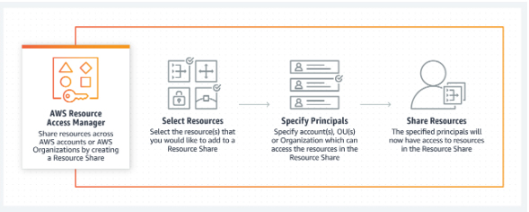
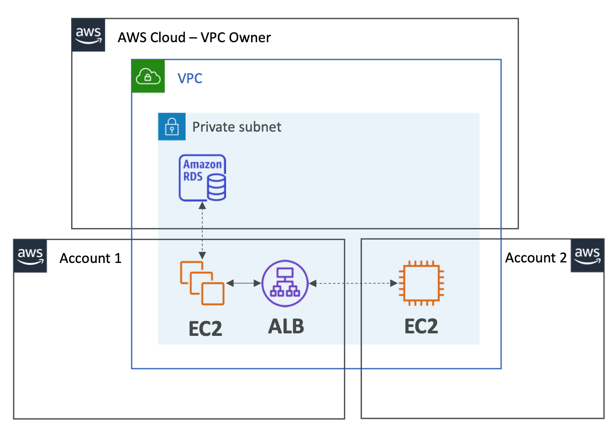

# AWS Resource Access Manager

- A service that enables you to easily and securely share AWS resources  with any AWS account or, if you are part of AWS Organizations, with  Organizational Units (OUs) or your entire Organization. If you share  resources with accounts that are outside of your Organization, then  those accounts will receive an invitation to the Resource Share and can  start using the shared resources upon accepting the invitation.
  - Only the master account can enable sharing with AWS Organizations.
  - The organization must be enabled for all features.
- RAM eliminates the need to create duplicate resources in multiple accounts. You can create resources centrally in a multi-account environment, and  use RAM to share those resources across accounts in three simple steps: 
  1. Create a Resource Share
  2. Specify resources
  3. Specify accounts

- You can stop sharing a resource by deleting the share in AWS RAM.
- Services you can share with AWS RAM
  - [AWS App Mesh](https://docs.aws.amazon.com/ram/latest/userguide/shareable.html#shareable-appmesh)
  - [Amazon Aurora](https://docs.aws.amazon.com/ram/latest/userguide/shareable.html#shareable-aur)
  - [AWS CodeBuild](https://docs.aws.amazon.com/ram/latest/userguide/shareable.html#shareable-codebuild)
  - [Amazon EC2](https://docs.aws.amazon.com/ram/latest/userguide/shareable.html#shareable-ec2)
  - [Amazon EC2 Image Builder](https://docs.aws.amazon.com/ram/latest/userguide/shareable.html#shareable-imagebuilder)
  - [AWS Glue](https://docs.aws.amazon.com/ram/latest/userguide/shareable.html#shareable-glue)
  - [AWS License Manager](https://docs.aws.amazon.com/ram/latest/userguide/shareable.html#shareable-byol)
  - [AWS Resource Groups](https://docs.aws.amazon.com/ram/latest/userguide/shareable.html#shareable-arg)
  - [Amazon Route 53](https://docs.aws.amazon.com/ram/latest/userguide/shareable.html#shareable-r53)
  - [Amazon VPC](https://docs.aws.amazon.com/ram/latest/userguide/shareable.html#shareable-vpc)

- Security
  - Use IAM policies to secure who can access resources that you shared or received from another account. 
- Pricing
  - There is no additional charge for using AWS RAM.

## VPC Subnets example

* **Each account...**
  * is responsible for its own
  * cannot view, modify or delete other resources in other accounts

* **Network is shared so...**
  * Anything deployed in the VPC can talk to other resources in the VPC
  * Applications are accessed easily across accounts, using private IP!
  * Security groups from other accounts can be referenced for maximum security

## Sources

 https://aws.amazon.com/ram/
 https://aws.amazon.com/ram/faqs/
 https://docs.aws.amazon.com/ram/latest/userguide/what-is.html
 https://aws.amazon.com/blogs/aws/new-aws-resource-access-manager-cross-account-resource-sharing/