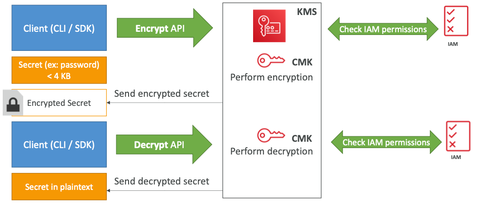

## AWS Key Management Service ( AWS KMS )

- A managed service that enables you to easily encrypt your data. KMS  provides a highly available key storage, management, and auditing  solution for you to encrypt data within your own applications and  control the encryption of stored data across AWS services.

### **Features**

- KMS is integrated with CloudTrail, which provides you the ability to audit who used which keys, on which resources, and when. 
- Customer master keys (CMKs) are used to control access to data encryption keys that encrypt and decrypt your data.
- You can choose to have KMS automatically rotate master keys created within  KMS once per year without the need to re-encrypt data that has already  been encrypted with your master key.
- To help ensure that your keys and your data is highly available, KMS  stores multiple copies of encrypted versions of your keys in systems  that are designed for 99.999999999% durability.

### **Concepts**

- **Customer Master Keys (CMKs)** – You can use a CMK to encrypt and decrypt up to 4 KB of data.  Typically, you use CMKs to generate, encrypt, and decrypt the data keys  that you use outside of KMS to encrypt your data. Master keys are  256-bits in length.
- There are three types of CMKs:

| **Type of CMK**      | **Can view** | **Can manage** | **Used only for my AWS account** |
| -------------------- | ------------ | -------------- | -------------------------------- |
| Customer managed CMK | Yes          | Yes            | Yes                              |
| AWS managed CMK      | Yes          | No             | Yes                              |
| AWS owned CMK        | No           | No             | No                               |

* 
  * ***Customer managed CMKs*** are CMKs that you create, own, and manage. You have full control over  these CMKs, including establishing and maintaining their key policies,  IAM policies, and grants, enabling and disabling them, rotating their  cryptographic material, adding tags, creating aliases that refer to the  CMK, and scheduling the CMKs for deletion.
  * ***AWS managed CMKs*** are CMKs in your account that are created, managed, and used on your  behalf by an AWS service that integrates with KMS. You can view the AWS  managed CMKs in your account, view their key policies, and audit their  use in CloudTrail logs. However, you cannot manage these CMKs or change  their permissions. And, you cannot use AWS managed CMKs in cryptographic operations directly; the service that creates them uses them on your  behalf.
  * ***AWS owned CMKs*** are not in your AWS account. They are part of a collection of CMKs that AWS owns and manages for use in multiple AWS accounts. AWS services can use AWS owned CMKs to protect your data. You cannot view, manage, or  use AWS owned CMKs, or audit their use.

- Data keys – Encryption keys that you can use to encrypt data, including large amounts of data and other data encryption keys.
  - You can use CMKs to generate, encrypt, and decrypt data keys. However, KMS  does not store, manage, or track your data keys, or perform  cryptographic operations with data keys.
    - **KMS can only help in encripting up to 4 KB of data per call**
  - Data keys can be generated at 128-bit or 256-bit lengths and encrypted under a master key you define.
- **Envelope encryption** -The practice of encrypting plaintext data with a data key, and then  encrypting the data key under another key. The top-level plaintext key encryption key is known as the *master key*.
  - **if data > 4 KB, use Envelope Encription**
- **Encryption Context** – All KMS cryptographic operations accept an encryption context, an  optional set of key–value pairs that can contain additional contextual  information about the data.
- **Key Policies – When you create a CMK, permissions that determine who can use and  manage that CMK are contained in a document called the key policy.**
- **Grants** – A grant is an alternative to the key policy. You can use grants to give long-term access that allows AWS principals to use your customer managed CMKs.
- **Grant Tokens** – When you create a grant, the permissions specified in the grant might not take effect immediately due to eventual consistency. If you need to mitigate the potential delay, use a grant token instead.
- When you enable ***automatic key rotation*** for a customer managed CMK, KMS generates new cryptographic material  for the CMK every year. KMS also saves the CMK’s older cryptographic  material so it can be used to decrypt data that it encrypted.
- An *alias* is an optional display name for a CMK. Each CMK can have multiple  aliases, but each alias points to only one CMK. The alias name must be  unique in the AWS account and region.

### How does KMS work?  API – Encrypt and Decrypt

### **Importing Keys**

- A CMK contains the **key material** used to encrypt and decrypt data. When you create a CMK, by default AWS KMS generates the key material for that CMK. But you can create a CMK  without key material and then import your own key material into that  CMK.
- When you import key material, you can specify an expiration date. When the  key material expires, KMS deletes the key material and the CMK becomes  unusable. You can also delete key material on demand.

### **Deleting Keys**

- Deleting a CMK deletes the key material and all metadata associated with the CMK and is irreversible. You can no longer decrypt the data that was  encrypted under that CMK, which means that data becomes unrecoverable.
- You can temporarily disable keys so they cannot be used by anyone.
- KMS supports custom key stores backed by AWS CloudHSM clusters. A key store is a secure location for storing cryptographic keys. 
- You can connect directly to AWS KMS through a private endpoint in your VPC  instead of connecting over the internet. When you use a VPC endpoint,  communication between your VPC and AWS KMS is conducted entirely within  the AWS network.

### **Pricing**

- Each customer master key that you create in KMS, regardless of whether you  use it with KMS-generated key material or key material imported by you,  costs you until you delete it.
- For a CMK with key material generated by KMS, if you opt-in to have the CMK automatically rotated each year, each newly rotated version will raise  the cost of the CMK per month.

### **Limits**

| **Resource**         | **Default Limit** | **Applies To**           |
| -------------------- | ----------------- | ------------------------ |
| Customer Master Keys | 10,000            | Customer managed CMKs    |
| Aliases              | 10,000            | Customer created aliases |
| Grants per CMK       | 10,000            | Customer managed CMKs    |

 

Sources:
 https://docs.aws.amazon.com/kms/latest/developerguide
 https://aws.amazon.com/kms/features/
 https://aws.amazon.com/kms/pricing/
 https://aws.amazon.com/kms/faqs/