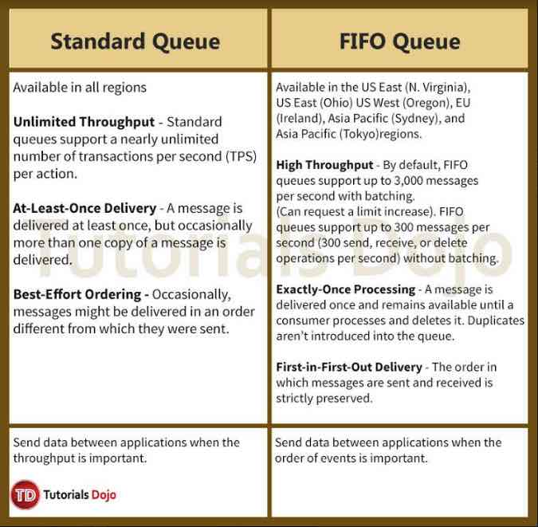

# Amazon SQS

- A hosted queue that lets you integrate and decouple distributed software systems and components.
- SQS supports both **standard** and **FIFO queues**.
- SQS uses pull based (polling) not push based
- Users can access Amazon SQS from their VPC using VPC endpoints, without using public IPs, and without needing to traverse the public internet. VPC endpoints for Amazon SQS are powered by AWS PrivateLink.
- **Benefits**
  - You control who can send messages to and receive messages from an SQS queue.
  - Supports server-side encryption.
  - SQS stores messages on multiple servers for durability.
  - SQS uses redundant infrastructure to provide highly-concurrent access to messages and high availability for producing and consuming messages.
  - SQS can scale to process each buffered request and handle any load increases or spikes independently.
  - SQS locks your messages during processing, so that multiple producers can send and multiple consumers can receive messages at the same time.
- **Types of Queues**

- You can include structured metadata (such as timestamps, geospatial data, signatures, and identifiers) with messages using **message attributes**.

- **Message timers** let you specify an initial invisibility period for a message added to a queue. The default (minimum) invisibility period for a message is 0 seconds. The maximum is 15 minutes.

- SQS doesn’t automatically delete a message after receiving it for you, in case you don’t successfully receive the message.

- You can subscribe one or more SQS queues to an Amazon SNS topic from a list of topics available for the selected queue.

- You can configure an existing SQS queue to trigger an AWS Lambda function when new messages arrive in a queue.

  - Your queue and Lambda function must be in the same AWS Region.
  - FIFO queues also support Lambda function triggers.
  - You can associate only one queue with one or more Lambda functions.
  - You can’t associate an encrypted queue that uses an AWS managed Customer Master Key for SQS with a Lambda function in a different AWS account.

- You can delete all the messages in your queue by **purging** them.

- Long polling

   helps reduce the cost by eliminating the number of empty responses and false empty responses. While the regular 

  short polling

   returns immediately, even if the message queue being polled is empty, long polling doesn’t return a response until a message arrives in the message queue, or the long poll times out.

  - Short polling occurs when the *WaitTimeSeconds* parameter of a *ReceiveMessage* request is set to 0.

- To prevent other consumers from processing a message redundantly, SQS sets a **visibility timeout**, a period of time SQS prevents other consumers from receiving and processing the message. The default visibility timeout for a message is 30 seconds. The minimum is 0 seconds. The maximum is 12 hours.

- SQS supports **dead-letter queues**, which other queues can target for messages that can’t be processed successfully.
- **Delay queues** let you postpone the delivery of new messages to a queue for a number of seconds.

- **Basic SQS Architecture**
  - Main Parts
    - The components of your distributed system
    - The queue
    - The messages
  - Standard Queues
    - Default queue type.
    - Makes a best effort to preserve the order of messages.
    - Stores copies of your messages on multiple servers for redundancy and high availability.
    - Consumes messages using **short polling** (default) – take a subset of SQS servers (based on a weighted random distribution) and returns messages from only those servers.
  - FIFO Queues
    - The order in which messages are sent and received is strictly preserved and a message is delivered once and remains available until a consumer processes and deletes it.
    - Duplicates aren’t introduced into the queue.
    - FIFO queues support **message groups** that allow multiple ordered message groups within a single queue.
  - When you create a new queue, you must specify a *queue name* unique for your AWS account and region. This becomes your queue url.
    https://sqs.*region*.amazonaws.com/*accountnumber*/*queuename*
  - Each message receives a system-assigned *message ID* for identifying messages.
  - Every time you receive a message from a queue, you receive a *receipt handle* for that message.
- You can use **cost allocation tags** to organize your AWS bill to reflect your own cost structure.
- Send, receive, or delete messages in **batches** of up to 10 messages or 256KB.
- **Dead-Letter Queues**
  - A dead-letter queue lets you set aside and isolate messages that can’t be processed correctly to determine why their processing didn’t succeed.
  - Setting up a dead-letter queue allows you to do the following:
    - Configure an alarm for any messages delivered to a dead-letter queue.
    - Examine logs for exceptions that might have caused messages to be delivered to a dead-letter queue.
    - Analyze the contents of messages delivered to a dead-letter queue to diagnose software or the producer’s or consumer’s hardware issues.
    - Determine whether you have given your consumer sufficient time to process messages.
  - When to use a dead-letter queue
    - When you have a standard SQS queue, to avoid additional costs from SQS handling failed messages over and over again. Dead-letter queues can help you troubleshoot incorrect message transmission operations.
    - To decrease the number of messages and to reduce the possibility of exposing your system to poison-pill messages (messages that can be received but can’t be processed).
  - When not to use a dead-letter queue
    - When you want to be able to keep retrying the transmission of a message indefinitely in your SQS standard queue.
    - When you don’t want to break the exact order of messages or operations in your SQS FIFO queue.
- **Best Practices**
  - Extend the message’s visibility timeout to the maximum time it takes to process and delete the message. If you don’t know how long it takes to process a message, as long as your consumer still works on the message, keep extending the visibility timeout .
  - Using the appropriate polling mode.
  - Configure a dead-letter queue to capture problematic messages.
  - To avoid inconsistent message processing by standard queues, avoid setting the number of maximum receives to 1 when you configure a dead-letter queue.
  - Don’t create reply queues per message. Instead, create reply queues on startup, per producer, and use a correlation ID message attribute to map replies to requests. Don’t let your producers share reply queues.
  - Reduce cost by batching message actions.
  - Use message deduplication IDs to monitor duplicate sent messages.
- **Monitoring, Logging, and Automating**
  - Monitor SQS queues using CloudWatch
  - Log SQS API Calls Using AWS CloudTrail
  - Automate notifications from AWS Services to SQS using CloudWatch Events
- **Security**
  - Use IAM for user authentication.
  - SQS has its own resource-based permissions system that uses policies written in the same language used for IAM policies.
  - Protect data using Server-Side Encryption and AWS KMS.
  - SSE encrypts messages as soon as Amazon SQS receives them. The messages are stored in encrypted form and Amazon SQS decrypts messages only when they are sent to an authorized consumer.
- **Pricing**
  - You are charged per 1 million SQS requests. Price depends on the type of queue being used. Requests include:
    - API Actions
    - FIFO Requests
    - A single request of 1 to 10 messages, up to a maximum total payload of 256 KB
    - Each 64 KB chunk of a payload is billed as 1 request
    - Interaction with Amazon S3
    - Interaction with AWS KMS
  - Data transfer out of SQS per TB/month after consuming 1 GB for that month
- **Limits**

| **Limit**                                                    | **Description**                                              |
| ------------------------------------------------------------ | ------------------------------------------------------------ |
| Delay queue                                                  | The default (minimum) delay for a queue is 0 seconds. The maximum is 15 minutes. |
| Inflight messages per queue                                  | For most standard queues , there can be a maximum of approximately 120,000 inflight messages (received from a queue by a consumer, but not yet deleted from the queue). You can request a limit increase. |
| For FIFO queues, there can be a maximum of 20,000 inflight messages (received from a queue by a consumer, but not yet deleted from the queue). |                                                              |
| Queue name                                                   | A queue name can have up to 80 characters. The following characters are accepted: alphanumeric characters, hyphens, and underscores. Queue names are case-sensitive. |
| The name of a FIFO queue must end with the .fifo suffix. The suffix counts towards the 80-character queue name limit. |                                                              |
| Message attributes                                           | A message can contain up to 10 metadata attributes.          |
| Message batch                                                | A single message batch request can include a maximum of 10 messages. |
| Message throughput                                           | Standard queues support a nearly unlimited number of transactions per second (TPS) per action. |
| By default, FIFO queues support up to 3,000 messages per second with batching.FIFO queues support up to 300 messages per second (300 send, receive, or delete operations per second) without batching. |                                                              |
| Message visibility timeout                                   | The default visibility timeout for a message is 30 seconds. The minimum is 0 seconds. The maximum is 12 hours. |



**Choosing the Right Messaging Service for Your Distributed App:**

https://youtu.be/4-JmX6MIDDI

**Amazon SQS-related Cheat Sheets:**

- [Amazon Simple Workflow (SWF) vs AWS Step Functions vs Amazon SQS](https://tutorialsdojo.com/amazon-simple-workflow-swf-vs-aws-step-functions-vs-amazon-sqs/)

