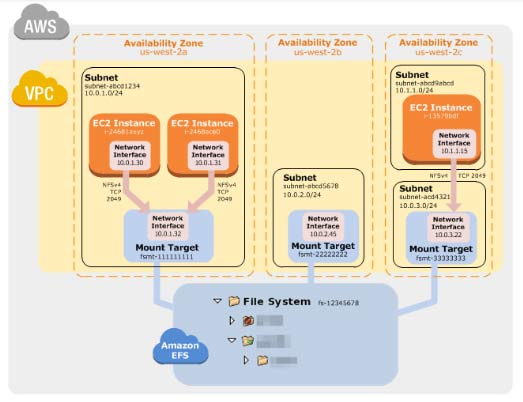

# Amazon EFS

- A fully-managed **file storage service** that makes it easy to set up and scale file storage in the Amazon Cloud.

### **Features**

- The service manages all the file storage infrastructure for you, avoiding  the complexity of deploying, patching, and maintaining complex file  system configurations.
- EFS supports the Network File System version 4 protocol.
- Multiple Amazon EC2 instances can access an EFS file system at the same time,  providing a common data source for workloads and applications running on more than one instance or server.
- EFS file systems store data and metadata across multiple Availability Zones in an AWS Region.
- EFS file systems can grow to petabyte scale, drive high levels of  throughput, and allow massively parallel access from EC2 instances to  your data.
- EFS provides file system access semantics, such as strong data consistency and file locking.
- EFS enables you to control access to your file systems through Portable Operating System Interface (POSIX) permissions.
- Moving your EFS file data can be managed simply with AWS DataSync – a managed  data transfer service that makes it faster and simpler to move data  between on-premises storage and Amazon EFS.
- You can schedule automatic incremental backups of your EFS file system using the EFS-to-EFS Backup solution.
- Amazon EFS Infrequent Access (EFS IA) is a new storage class for Amazon EFS  that is cost-optimized for files that are accessed less frequently.  Customers can use EFS IA by creating a new file system and enabling  Lifecycle Management. With Lifecycle Management enabled, EFS  automatically will move files that have not been accessed for 30 days  from the Standard storage class to the Infrequent Access storage class. 

### **Performance Modes**

- General purpose performance mode (default)
  - Ideal for latency-sensitive use cases.
- Max I/O mode
  - Can scale to higher levels of aggregate throughput and operations per  second with a tradeoff of slightly higher latencies for file operations.

### **Throughput Modes**

- Bursting Throughput mode (default)
  - Throughput scales as your file system grows.
- Provisioned Throughput mode
  - You specify the throughput of your file system independent of the amount of data stored.

### **Mount Targets**

- To access your EFS file system in a VPC, you create one or more **mount targets** in the VPC. A mount target provides an IP address for an NFSv4 endpoint. 
- You can create one mount target in each Availability Zone in a region. 
- You mount your file system using its DNS name, which will resolve to the IP address of the EFS mount target. Format of DNS is
   *File-system-id*.efs.*aws-region*.amazonaws.com

- When using Amazon EFS with an on-premises server, your on-premises server must have a Linux based operating system.

### **Access Points**

- EFS Access Points simplify how applications are provided access to shared data sets in an EFS file system. 
- EFS Access Points work together with AWS IAM and enforce an operating  system user and group, and a directory for every file system request  made through the access point. 

### **Components of a File System**

- ID
- creation token
- creation time
- file system size in bytes
- number of mount targets created for the file system
- file system state
- mount target

### **Data Consistency in EFS**

- EFS provides the **open-after-close consistency semantics** that applications expect from NFS.
- Write operations will be durably stored across Availability Zones.
- Applications that perform synchronous data access and perform non-appending writes will have **read-after-write consistency** for data access.

### **Managing File Systems**

- You can create encrypted file systems. EFS supports encryption in transit and encryption at rest.
- Managing file system network accessibility refers to managing the mount targets:
  - Creating and deleting mount targets in a VPC
  - Updating the mount target configuration
- You can create new tags, update values of existing tags, or delete tags associated with a file system.
- The following list explains the metered data size for different types of file system objects.
  - **Regular files** – the metered data size of a regular file is the logical size of the  file rounded to the next 4-KiB increment, except that it may be less for sparse files.
    - A sparse file is a file to which data is not written to all positions of  the file before its logical size is reached. For a sparse file, if the  actual storage used is less than the logical size rounded to the next  4-KiB increment, Amazon EFS reports actual storage used as the metered  data size.
  - **Directories** – the metered data size of a directory is the actual storage used for  the directory entries and the data structure that holds them, rounded to the next 4 KiB increment. The metered data size doesn’t include the  actual storage used by the file data.
  - **Symbolic links and special files** – the metered data size for these objects is always 4 KiB.
- **File system deletion is a destructive action that you can’t undo.** You lose the file system and any data you have in it, and you can’t  restore the data. You should always unmount a file system before you  delete it.
- You can use  AWS DataSync to automatically, efficiently, and securely copy files  between two Amazon EFS resources, including file systems in different  AWS Regions and ones owned by different AWS accounts. Using DataSync to copy data between EFS file systems, you can perform one-time  migrations, periodic ingest for distributed workloads, or automate  replication for data protection and recovery.

### **Mounting File Systems**

- To mount your EFS file system on your EC2 instance, use the mount helper in the *amazon-efs-utils package*.
- You can mount your EFS file systems on your on-premises data center servers when connected to your Amazon VPC with AWS Direct Connect or VPN.
- You can use **fstab** to automatically mount your file system using the mount helper whenever the EC2 instance is mounted on reboots.

### **Lifecycle Management**

- You can choose from four EFS Lifecycle Management policies (14, 30, 60, or  90 days) to automatically move files into the EFS Infrequent Access (EFS IA) storage class and save up to 85% in cost.

### **Monitoring File Systems**

- Amazon CloudWatch Alarms
- Amazon CloudWatch Logs
- Amazon CloudWatch Events
- AWS CloudTrail Log Monitoring
- Log files on your file system

### **Security**

- You must have valid credentials to make EFS API requests, such as create a file system. 
- You must also have permissions to create or access resources.
- When you first create the file system, there is only one root directory at  /. By default, only the root user (UID 0) has read-write-execute  permissions.
- Specify EC2 security groups for your EC2 instances and security groups for the  EFS mount targets associated with the file system.
- You can use AWS IAM to manage Network File System (NFS) access for Amazon  EFS. You can use IAM roles to identify NFS clients with cryptographic  security and use IAM policies to manage client-specific permissions.

### **Pricing**

- You pay only for the storage used by your file system.
- Costs related to Provisioned Throughput are determined by the throughput values you specify.

### **EFS vs EBS vs S3**

- Performance Comparison

|                       | **Amazon EFS**           | **Amazon EBS Provisioned IOPS** |
| --------------------- | ------------------------ | ------------------------------- |
| Per-operation latency | Low, consistent latency. | Lowest, consistent latency.     |
| Throughput scale      | Multiple GBs per second  | Single GB per second            |

- Performance Comparison

|                       | **Amazon EFS**           | **Amazon S3**                                                |
| --------------------- | ------------------------ | ------------------------------------------------------------ |
| Per-operation latency | Low, consistent latency. | Low, for mixed request types, and integration with CloudFront. |
| Throughput scale      | Multiple GBs per second  | Multiple GBs per second                                      |

- Storage Comparison

|                             | **Amazon EFS**                                               | **Amazon EBS Provisioned IOPS**                              |
| --------------------------- | ------------------------------------------------------------ | ------------------------------------------------------------ |
| Availability and durability | Data are stored redundantly across multiple AZs.             | Data are stored redundantly in a single AZ.                  |
| Access                      | Up to thousands of EC2 instances from multiple AZs can connect concurrently to a file system. | A single EC2 instance in a single AZ can connect to a file system. |
| Use cases                   | Big data and analytics, media processing workflows, content management, web serving, and home directories. | Boot volumes, transactional and NoSQL databases, data warehousing, and ETL. |

 

|                             | **Amazon EFS**                                               | **Amazon S3**                                                |
| --------------------------- | ------------------------------------------------------------ | ------------------------------------------------------------ |
| Availability and durability | Data are stored redundantly across multiple AZs.             | Stored redundantly across multiple AZs.                      |
| Access                      | Up to thousands of EC2 instances from multiple AZs can connect concurrently to a file system. | One to millions of connections over the web.                 |
| Use cases                   | Big data and analytics, media processing workflows, content management, web serving, and home directories. | Web serving and content management, media and entertainment, backups, big data analytics, data lake. |

### **Limits**

| **Resource**                                                 | **Default Limit** |
| ------------------------------------------------------------ | ----------------- |
| Number of file systems for each customer account in an AWS Region | 1,000             |
| Number of mount targets for each file system in an Availability Zone in a Region | 1                 |
| Number of mount targets for each VPC in a Region             | 400               |
| Number of security groups for each mount target              | 5                 |
| Number of VPCs for each file system                          | 1                 |
| Maximum size of a single file                                | 47.9 TiB          |

 

#### **Free Amazon EFS Tutorials on YouTube:**

https://www.youtube.com/user/AmazonWebServices/search?query=EFS

**Other Amazon EFS-related Cheat Sheets:**

- [Amazon S3 vs EBS vs EFS](../comparison-of-aws-services/s3-vs-ebs-vs-efs.md)

 

Sources:
 https://docs.aws.amazon.com/efs/latest/ug/
 https://aws.amazon.com/efs/pricing/
 https://aws.amazon.com/efs/faq/
 https://aws.amazon.com/efs/features/
 https://aws.amazon.com/efs/when-to-choose-efs/