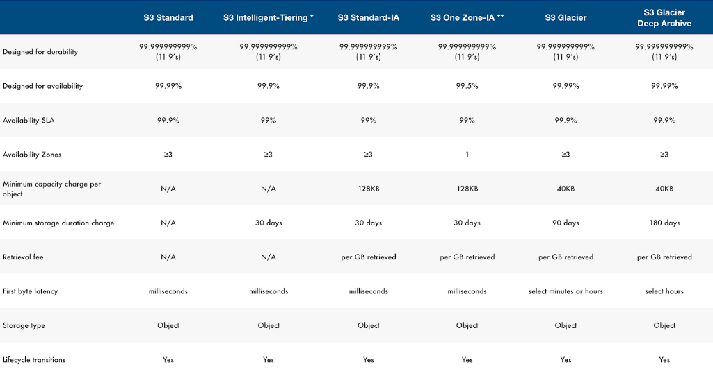
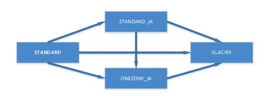
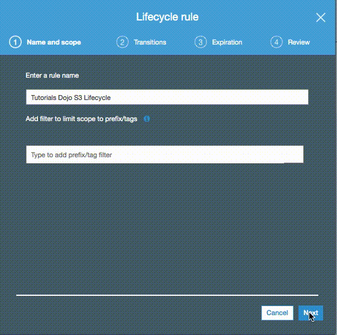
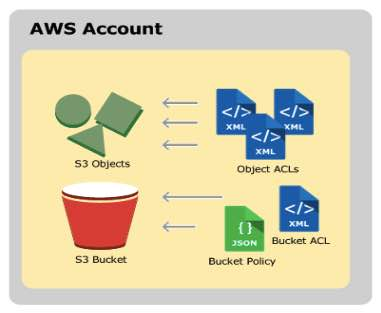
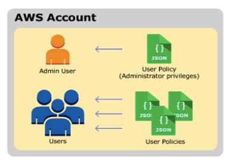
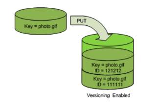
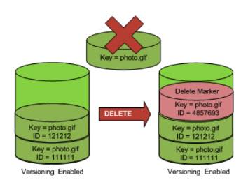
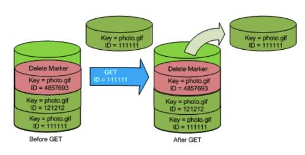

# Amazon S3

- S3 stores data as objects within **buckets**. 
- An **object** consists of a file and optionally any metadata that describes that file.
- A **key** is the unique identifier for an object within a bucket.
- Storage capacity is virtually unlimited.

### **Buckets**

- For each bucket, you can:

  - Control access to it (create, delete, and list objects in the bucket)
  - View access logs for it and its objects
  - Choose the geographical region where to store the bucket and its contents.

- Bucket name 

  must be a unique DNS-compliant name.

  - The name must be unique across all existing bucket names in Amazon S3.
  - After you create the bucket you cannot change the name.
  - The bucket name is visible in the URL that points to the objects that you’re going to put in your bucket.

- By default, you can create up to 100 buckets in each of your AWS accounts.

- You can’t change its Region after creation.

- You can host static websites by configuring your bucket for website hosting.

- You can’t delete an S3 bucket using the Amazon S3 console if the bucket  contains 100,000 or more objects. You can’t delete an S3 bucket using  the AWS CLI if versioning is enabled.

### **Data Consistency Model**

- read-after-write consistency for PUTS of new objects in your S3 bucket in all regions
- eventual consistency for read-after-write HEAD or GET requests
- eventual consistency for overwrite PUTS and DELETES in all regions

### **Storage Classes**

- Storage Classes for Frequently Accessed Objects
  - S3 **STANDARD** for **general-purpose** storage of frequently accessed data.
- Storage Classes for Infrequently Accessed Objects
  - S3 **STANDARD_IA** for long-lived, but **less frequently accessed** data. It stores the object data redundantly across multiple geographically separated AZs.
  - S3 **ONEZONE_IA** stores the object data in only one AZ. Less expensive than STANDARD_IA, but  data is not resilient to the physical loss of the AZ.
  - These two storage classes are suitable for objects larger than 128 KB that you plan to store for **at least 30 days**. If an object is less than 128 KB, Amazon S3 charges you for 128 KB. If  you delete an object before the 30-day minimum, you are charged for 30  days.
- Amazon S3 Intelligent Tiering
  - S3 Intelligent-Tiering is a storage class designed for customers who want  to optimize storage costs automatically when data access patterns  change, without performance impact or operational overhead. 
  - S3 Intelligent-Tiering is the first cloud object storage class that  delivers automatic cost savings by moving data between two access tiers — frequent access and infrequent access — when access patterns change,  and is ideal for data with unknown or changing access patterns.
  - S3 Intelligent-Tiering monitors access patterns and moves objects that  have not been accessed for 30 consecutive days to the infrequent access  tier. If an object in the infrequent access tier is accessed later, it  is automatically moved back to the frequent access tier.
  - There are no retrieval fees in S3 Intelligent-Tiering.
- GLACIER
  - For long-term **archive**
  - Archived objects are not available for real-time access. You must first restore the objects before you can access them.
  - You cannot specify GLACIER as the storage class at the time that you create an object.
  - Glacier objects are visible through S3 only.
  - Retrieval Options
    - **Expedited** – allows you to quickly access your data when occasional urgent  requests for a subset of archives are required. For all but the largest  archived objects, data accessed are typically made available within 1–5  minutes. There are two types of Expedited retrievals: On-Demand requests are similar to EC2 On-Demand instances and are available most of the  time. Provisioned requests are guaranteed to be available when you need  them.
    - **Standard** – allows you to access any of your archived objects within several  hours. Standard retrievals typically complete within 3–5 hours. This is  the default option for retrieval requests that do not specify the  retrieval option.
    - **Bulk** – Glacier’s lowest-cost retrieval option, enabling you to retrieve  large amounts, even petabytes, of data inexpensively in a day. Bulk  retrievals typically complete within 5–12 hours.
  - For S3 Standard, S3 Standard-IA, and Glacier storage classes, your objects  are automatically stored across multiple devices spanning a **minimum of three** Availability Zones.

- Amazon S3 Glacier Deep Archive
  - A new Amazon S3 storage class providing secure and durable object storage for long-term retention of data that is accessed rarely in a year. 
  - S3 Glacier Deep Archive offers the lowest cost storage in the cloud, at  prices lower than storing and maintaining data in on-premises magnetic  tape libraries or archiving data offsite. 
  - All objects stored in the S3 Glacier Deep Archive storage class are  replicated and stored across at least three geographically-dispersed  Availability Zones, protected by 99.999999999% durability, and can be  restored within 12 hours or less. 
  - S3 Glacier Deep Archive also offers a bulk retrieval option, where you can retrieve petabytes of data within 48 hours.

### **S3 API**

- REST – use standard HTTP requests to create, fetch, and delete buckets and  objects. You can use S3 virtual hosting to address a bucket in a REST  API call by using the HTTP *Host* header.
- SOAP – support for SOAP over HTTP is deprecated, but it is still available over HTTPS. However, new Amazon S3 features will not be supported for SOAP. AWS  recommends using either the REST API or the AWS SDKs.

### **Bucket Configurations**

| **Subresource**                          | **Description**                                              |
| ---------------------------------------- | ------------------------------------------------------------ |
| *location*                               | Specify the AWS Region where you want S3 to create the bucket. |
| *policy* and *ACL* (access control list) | All your resources are private by default. Use bucket policy and ACL options to grant and manage bucket-level permissions. |
| *cors* (cross-origin resource sharing)   | You can configure your bucket to allow cross-origin requests. CORS defines a way for client web applications that are loaded in one domain to  interact with resources in a different domain. |
| *website*                                | You can configure your bucket for static website hosting.    |
| *logging*                                | Logging enables you to track requests for access to your bucket. Each access  log record provides details about a single access request, such as the  requester, bucket name, request time, request action, response status,  and error code, if any. |
| *event notification*                     | You can enable your bucket to send you notifications of specified bucket events. |
| *versioning*                             | AWS recommends VERSIONING AS A BEST PRACTICE to recover objects from being deleted or overwritten by mistake. |
| *lifecycle*                              | You can define lifecycle rules for objects in your bucket that have a well-defined lifecycle. |
| cross-region replication                 | Cross-region replication is the automatic, asynchronous copying of objects across buckets in different AWS Regions. |
| *tagging*                                | S3 provides the *tagging* subresource to store and manage tags on a bucket. AWS generates a cost  allocation report with usage and costs aggregated by your tags. |
| *requestPayment*                         | By default, the AWS account that creates the bucket (the bucket owner)  pays for downloads from the bucket. The bucket owner can specify that  the person requesting the download will be charged for the download. |
| *transfer acceleration*                  | Transfer Acceleration enables fast, easy, and secure transfers of files over  long distances between your client and an S3 bucket. It takes advantage  of Amazon CloudFront’s globally distributed **edge locations**. |

 

### **Objects**

- Are private by default. Grant permissions to other users.
- Each S3 object has **data**, a **key**, and **metadata**.
- You cannot modify object metadata after object is uploaded.
- Two kinds of metadata
  - System metadata

| **Name**                                        | **Description**                                              | **Can User Modify the Value?** |
| ----------------------------------------------- | ------------------------------------------------------------ | ------------------------------ |
| Date                                            | Current date and time.                                       | No                             |
| Content-Length                                  | Object size in bytes.                                        | No                             |
| Last-Modified                                   | Object creation date or the last modified date, whichever is the latest. | No                             |
| Content-MD5                                     | The base64-encoded 128-bit MD5 digest of the object.         | No                             |
| x-amz-server-side-encryption                    | Indicates whether server-side encryption is enabled for the object, and whether  that encryption is from the AWS Key Management Service (SSE-KMS) or from AWS managed encryption (SSE-S3). | Yes                            |
| x-amz-version-id                                | Object version. When you enable versioning on a bucket, Amazon S3 assigns a version number to objects added to the bucket. | No                             |
| x-amz-delete-marker                             | In a bucket that has versioning enabled, this Boolean marker indicates whether the object is a delete marker. | No                             |
| x-amz-storage-class                             | Storage class used for storing the object.                   | Yes                            |
| x-amz-website-redirect-location                 | Redirects requests for the associated object to another object in the same bucket or an external URL. | Yes                            |
| x-amz-server-side-encryption-aws-kms-key-id     | If x-amz-server-side-encryption is present and has the value of aws:kms, this indicates the ID of the AWS Key Management Service (AWS KMS) master encryption key that was used for the object. | Yes                            |
| x-amz-server-side-encryption-customer-algorithm | Indicates whether server-side encryption with customer-provided encryption keys (SSE-C) is enabled. | Yes                            |

 

- - User-defined metadata – key-value pair that you provide.

- You can upload and copy objects of up to **5 GB** in size in a single operation. For objects greater than 5 GB up to **5 TB**, you must use the **multipart upload API**.
- Tagging
  - You can associate up to 10 tags with an object. Tags associated with an object must have unique tag keys.
  - A tag key can be up to 128 Unicode characters in length and tag values can be up to 256 Unicode characters in length.
  - Key and values are case sensitive.
- Object Delete
  - Deleting Objects from a Version-Enabled Bucket
    - Specify a non-versioned delete request – specify only the object’s key, and not the version ID.
    - Specify a versioned delete request – specify both the key and also a version ID. 
  - Deleting Objects from an MFA-Enabled Bucket
    - If you provide an invalid MFA token, the request always fails.
    - If you are not deleting a versioned object, and you don’t provide an MFA token, the delete succeeds.
- S3 Select
  - S3 Select is an Amazon S3 capability designed to pull out only the data  you need from an object, which can dramatically improve the performance  and reduce the cost of applications that need to access data in S3.
  - Amazon S3 Select works on objects stored in CSV and JSON format, Apache  Parquet format, JSON Arrays, and BZIP2 compression for CSV and JSON  objects.
  - CloudWatch Metrics for S3 Select lets you monitor S3 Select usage for your  applications. These metrics are available at 1-minute intervals and lets you quickly identify and act on operational issues.
- Lifecycle Management
  - A *lifecycle configuration* is a set of rules that define actions that is applied to a group of objects. 

- - - Transition actions—Define when objects transition to another storage class. For  S3-IA and S3-One-Zone, the objects must be stored at least 30 days in  the current storage class before you can transition them to another  class.

- - - Expiration actions—Define when objects expire. S3 deletes expired objects on your behalf.

### **Pricing**

- S3 charges you only for what you actually use, with no hidden fees and no overage charges
- No charge for creating a bucket, but only for storing objects in the  bucket and for transferring objects in and out of the bucket.

| **Charge**         | **Comments**                                                 |
| ------------------ | ------------------------------------------------------------ |
| Storage            | You pay for storing objects in your S3 buckets. The rate you’re charged  depends on your objects’ size, how long you stored the objects during  the month, and the storage class. |
| Requests           | You pay for requests, for example, GET requests, made against your S3  buckets and objects. This includes lifecycle requests. The rates for  requests depend on what kind of request you’re making. |
| Retrievals         | You pay for retrieving objects that are stored in STANDARD_IA, ONEZONE_IA, and GLACIER storage. |
| Early Deletes      | If you delete an object stored in STANDARD_IA, ONEZONE_IA, or GLACIER  storage before the minimum storage commitment has passed, you pay an  early deletion fee for that object. |
| Storage Management | You pay for the storage management features that are enabled on your account’s buckets. |
| Bandwidth          | You pay for all bandwidth into and out of S3, except for the following:Data transferred in from the internetData transferred out to an Amazon EC2 instance, when the instance is in the same AWS Region as the S3 bucketData transferred out to Amazon CloudFrontYou also pay a fee for any data transferred using Amazon S3 Transfer Acceleration. |

 

### **Networking**

- Hosted-style access
  - Amazon S3 routes any virtual hosted–style requests to the US East (N.  Virginia) region by default if you use the endpoint s3.amazonaws.com,  instead of the region-specific endpoint.
  - Format:
    - http://bucket.s3.amazonaws.com
    - http://bucket.s3-aws-region.amazonaws.com
- Path-style access
  - In a path-style URL, the endpoint you use must match the Region in which the bucket resides.
  - Format: 
    - US East (N. Virginia) Region endpoint, http://s3.amazonaws.com/bucket
    - Region-specific endpoint, http://s3-aws-region.amazonaws.com/bucket
- Customize S3 URLs with CNAMEs – the bucket name must be the same as the CNAME.
- **Amazon S3 Transfer Acceleration** enables fast, easy, and secure transfers of files over long distances  between your client and an S3 bucket. It takes advantage of Amazon  CloudFront’s globally distributed **edge locations**.
- Transfer Acceleration cannot be disabled, and can only be suspended.
- Transfer Acceleration URL is: *bucket*.s3-accelerate.amazonaws.com

### **Security**

- Policies contain the following:
  - **Resources** – buckets and objects 
  - **Actions** – set of operations
  - **Effect** – can be either allow or deny. Need to explicitly grant allow to a resource.
  - **Principal** – the account, service or user who is allowed access to the actions and resources in the statement.
- Resource Based Policies
  - Bucket Policies
    - Provides **centralized access control** to buckets and objects based on a variety of conditions, including S3  operations, requesters, resources, and aspects of the request (e.g., IP  address).
    - Can either **add or deny permissions** across all (or a subset) of objects within a bucket.
    - IAM users need additional permissions from root account to perform bucket operations.
    - Bucket policies are limited to 20 KB in size.
  - Access Control Lists
    - A list of grants identifying grantee and permission granted. 
    - ACLs use an S3–specific XML schema.
    - You can grant permissions only to other AWS accounts, not to users in your account.
    - You cannot grant conditional permissions, nor explicitly deny permissions.
    - Object ACLs are limited to 100 granted permissions per ACL.
    - The only recommended use case for the bucket ACL is to grant **write** permissions to the **S3 Log Delivery group**.

- User Policies
  - AWS IAM (see AWS Security and Identity Services)
    - IAM User Access Keys
    - Temporary Security Credentials

- Versioning
  - Use versioning to keep multiple versions of an object in one bucket.
  - Versioning protects you from the consequences of unintended overwrites and deletions. 
  - You can also use versioning to archive objects so you have access to previous versions.
  - Since versioning is disabled by default, need to EXPLICITLY enable.
  - When you PUT an object in a versioning-enabled bucket, the non-current version is not overwritten.

- - When you DELETE an object, all versions remain in the bucket and Amazon S3 inserts a delete marker.

- - Performing a simple GET Object request when the current version is a delete marker returns a 404 Not Found error. You can, however, GET a non-current  version of an object by specifying its version ID.

- - You can permanently delete an object by specifying the version you want to  delete. Only the owner of an Amazon S3 bucket can permanently delete a  version.

- Encryption
  - Server-side Encryption using
    - **Amazon S3-Managed Keys (SSE-S3)**
    - **AWS KMS-Managed Keys (SSE-KMS)**
    - **Customer-Provided Keys (SSE-C)**
  - Client-side Encryption using
    - AWS KMS-managed customer master key
    - client-side master key

- MFA Delete
  - MFA delete grants additional authentication for either of the following operations:
    - Change the versioning state of your bucket
    - Permanently delete an object version
  - MFA Delete requires two forms of authentication together:
    - Your security credentials
    - The concatenation of a valid serial number, a space, and the six-digit code displayed on an approved authentication device
- Cross-Account Access
  - You can provide another AWS account access to an object that is stored in  an Amazon Simple Storage Service (Amazon S3) bucket. These are the  methods on how to grant cross-account access to objects that are stored  in your own Amazon S3 bucket:
    - Resource-based policies and AWS Identity and Access Management (IAM) policies for programmatic-only access to S3 bucket objects 
    - Resource-based Access Control List (ACL) and IAM policies for programmatic-only access to S3 bucket objects 
    - Cross-account IAM roles for programmatic and console access to S3 bucket objects
- Requester Pays Buckets 
  - Bucket owners pay for all of the Amazon S3 storage and data transfer costs  associated with their bucket. To save on costs, you can enable the  Requester Pays feature so the requester will pay the cost of the request and the data download from the bucket instead of the bucket owner. Take note that the bucket owner always pays the cost of storing data.

- Monitoring
  - Automated monitoring tools to watch S3:
    - Amazon CloudWatch Alarms – Watch a single metric over a time period that you  specify, and perform one or more actions based on the value of the  metric relative to a given threshold over a number of time periods.
    - AWS CloudTrail Log Monitoring – Share log files between accounts, monitor  CloudTrail log files in real time by sending them to CloudWatch Logs,  write log processing applications in Java, and validate that your log  files have not changed after delivery by CloudTrail.
  - Monitoring with CloudWatch
    - Daily Storage Metrics for Buckets ‐ You can monitor bucket storage using  CloudWatch, which collects and processes storage data from S3 into  readable, daily metrics.
    - Request metrics ‐ You can choose to monitor S3 requests to quickly identify and act on operational issues. The metrics are available at 1 minute  intervals after some latency to process.
  - You can have a maximum of 1000 metrics configurations per bucket.
  - Supported event activities that occur in S3 are recorded in a CloudTrail event along with other AWS service events in **Event history**.

- Website Hosting

- - Enable website hosting in your bucket **Properties**.
  - Your static website is available via the region-specific website endpoint.
  - You must make the objects that you want to serve publicly readable by writing a bucket policy that grants everyone *s3:GetObject* permission.

| **Key Difference**                                         | **REST API Endpoint**                            | **Website Endpoint**                                         |
| ---------------------------------------------------------- | ------------------------------------------------ | ------------------------------------------------------------ |
| Access control                                             | Supports both public and private content.        | Supports only publicly readable content.                     |
| Error message handling                                     | Returns an XML-formatted error response.         | Returns an HTML document.                                    |
| Redirection support                                        | Not applicable                                   | Supports both object-level and bucket-level redirects.       |
| Requests supported                                         | Supports all bucket and object operations        | Supports only GET and HEAD requests on objects.              |
| Responses to GET and HEAD requests at the root of a bucket | Returns a list of the object keys in the bucket. | Returns the index document that is specified in the website configuration. |
| Secure Sockets Layer (SSL) support                         | Supports SSL connections.                        | Does not support SSL connections.                            |

 

- S3 Events Notification
  - To enable notifications, add a *notification configuration* identifying the events to be published, and the destinations where to send the event notifications. 
  - Can publish following events:
    - A new object created event
    - An object removal event
    - A Reduced Redundancy Storage (RRS) object lost event
  - Supports the following destinations for your events:
    - Amazon Simple Notification Service (Amazon SNS) topic
    - Amazon Simple Queue Service (Amazon SQS) queue
    - AWS Lambda

- Cross Region Replication
  - Enables automatic, asynchronous copying of objects across buckets in different AWS Regions.
  - When to use:
    - Comply with compliance requirements
    - Minimize latency
    - Increase operational efficiency
    - Maintain object copies under different ownership

- - Requirements of CRR:
    - Both source and destination buckets must have versioning enabled.
    - The source and destination buckets must be in different AWS Regions.
    - S3 must have permissions to replicate objects from the source bucket to the destination bucket on your behalf.
    - If the owner of the source bucket doesn’t own the object in the bucket,  the object owner must grant the bucket owner READ and READ_ACP  permissions with the object ACL.
  - Only the following are replicated:
    - Objects created after you add a replication configuration.
    - Both unencrypted objects and objects encrypted using Amazon S3 managed keys  (SSE-S3) or AWS KMS managed keys (SSE-KMS), although you must explicitly enable the option to replicate objects encrypted using KMS keys. The  replicated copy of the object is encrypted using the same type of  server-side encryption that was used for the source object.
    - Object metadata.
    - Only objects in the source bucket for which the bucket owner has permissions to read objects and access control lists.
    - Object ACL updates, unless you direct S3 to change the replica ownership when  source and destination buckets aren’t owned by the same accounts.
    - Object tags.
  - What isn’t replicated
    - Objects that existed before you added the replication configuration to the bucket.
    - Objects created with server-side encryption using customer-provided (SSE-C) encryption keys.
    - Objects created with server-side encryption using AWS KMS–managed encryption (SSE-KMS) keys. 
    - Objects in the source bucket that the bucket owner doesn’t have permissions for.
    - Updates to bucket-level subresources.
    - Actions performed by lifecycle configuration.
    - Objects in the source bucket that are replicas created by another cross-region  replication. You can replicate objects from a source bucket to **only one destination bucket**.
  - CRR delete operations
    - If you make a DELETE request without specifying an object version ID, S3 adds a delete marker. 
    - If you specify an object version ID to delete in a DELETE request, S3  deletes that object version in the source bucket, but it doesn’t  replicate the deletion in the destination bucket. This protects data  from malicious deletions.
- S3 Batch Operations is a new feature that makes it simple to manage  billions of objects stored in Amazon S3. Customers can make changes to  object properties and metadata, and perform other storage management  tasks – such as copying objects between buckets, replacing tag sets,  modifying access controls, and restoring archived objects from Amazon S3 Glacier – for any number of S3 objects in minutes.

#### **Amazon S3 Best Practices from AWS re:Invent**

https://youtu.be/rHeTn9pHNKo

**Amazon S3-related Cheat Sheets:**

- [Amazon S3 vs EBS vs EFS](../comparison-of-aws-services/s3-vs-ebs-vs-efs.md)
- [Amazon S3 vs Glacier](https://tutorialsdojo.com/amazon-s3-vs-glacier/)
- [S3 Standard vs S3 Standard-IA vs S3 One Zone-IA](https://tutorialsdojo.com/s3-standard-vs-s3-standard-ia-vs-s3-one-zone-ia/)
- [S3 Pre-signed URLs vs CloudFront Signed URLs vs Origin Access Identity (OAI)](https://tutorialsdojo.com/s3-pre-signed-urls-vs-cloudfront-signed-urls-vs-origin-access-identity-oai/)
- [S3 Transfer Acceleration vs Direct Connect vs VPN vs Snowball vs Snowmobile](https://tutorialsdojo.com/s3-transfer-acceleration-vs-direct-connect-vs-vpn-vs-snowball-vs-snowmobile/)