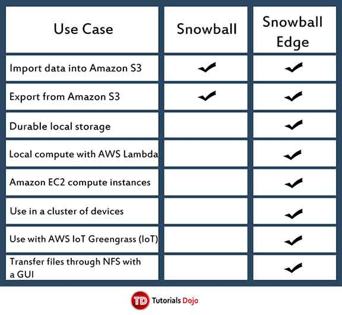

## **AWS Snowball**

- Accelerates transferring large amounts of data into and out of AWS using physical storage devices, bypassing the Internet.
- In the US regions, Snowballs come in two sizes: **50 TB and 80 TB**. All other regions have 80 TB Snowballs only.
- You possess the machine for **10 days for free** to perform your data transfer.
-  Features
  - Import and export data between your on-premises data storage locations and S3.
  - Snowball includes a 10GBaseT network connection.
  - Encryption is enforced, protecting your data at rest and in physical transit.
  - You can perform local data transfers between your on-premises data center and a Snowball.
- Snowball vs Snowball Edge 

| **Storage capacity (usable capacity)** | **Snowball** | **Snowball Edge** |
| -------------------------------------- | ------------ | ----------------- |
| 50 TB (42 TB) – US regions only        | ✓            |                   |
| 80 TB (72 TB)                          | ✓            |                   |
| 100 TB (83 TB)                         |              | ✓                 |
| 100 TB Clustered (45 TB per node)      |              | ✓                 |

 

| **Snowball Tools**                           | **Snowball Edge Tools**                           |
| -------------------------------------------- | ------------------------------------------------- |
| Snowball client with Snowball                | Snowball client with Snowball Edge                |
| Amazon S3 Adapter for Snowball with Snowball | Amazon S3 Adapter for Snowball with Snowball Edge |
|                                              | File interface with Snowball Edge                 |
|                                              | AWS IoT Greengrass console with Snowball Edge     |

- For security purposes, data transfers must be completed **within 90 days** of the Snowball being prepared.

- ### Snowball Jobs

  - Import into S3
    - The transfer of 80 TB or less of your data located in an on-premises data  source, copied onto a single Snowball, and then moved into S3. 
    - For import jobs, Snowballs and jobs have a one-to-one relationship, meaning that each job has exactly one Snowball associated with it. If you need  additional Snowballs, you can create new import jobs or clone existing  ones.
    - Each file or object that is imported must be less than or equal to 5 TB in size.
  - Export from S3
    - The transfer of any amount of data located in S3, copied onto any number of Snowballs, and then moved one Snowball at a time into your on-premises  data destination. 
    - When you create an export job, it’s split into job parts. Each job part is  no more than 80 TB in size, and each job part has exactly one Snowball  associated with it.

- ### Security

  - All data transferred to a Snowball has two layers of encryption:
    - A layer of encryption is applied in the memory of your local workstation. This encryption uses AES GCM 256-bit keys, and the keys are cycled for  every 60 GB of data transferred.
    - SSL encryption is a second layer of encryption for all data going onto or off of a standard Snowball.
  - Snowball uses server side-encryption (SSE) to protect data at rest.
  - Every Snowball job must be authenticated. You do this by creating and managing the IAM users in your account. 

- ### Data Validation

  - When you copy a file from a local data source using the Snowball client or  the Amazon S3 Adapter for Snowball, to the Snowball, a number of  checksums are created. These checksums are used to automatically  validate data as it’s transferred.

- ### Pricing

  - You pay a service fee per data transfer job (plus applicable shipping charges).
  - Each job includes the use of a Snowball device for 10 days of onsite usage  for free, and there is a small charge for extra onsite days. Shipping  days, including the day the device is received and the day it is shipped back to AWS, are not counted toward the 10 free days.

- ### Limits

  - For security purposes, data transfers must be completed within 90 days of the Snowball being prepared.
  - The default service limit for the number of Snowballs you can have at one time is 1.
  - Files must be in a static state while being copied.

**Other AWS Snowball-related Cheat Sheets:**

- [S3 Transfer Acceleration vs Direct Connect vs VPN vs Snowball vs Snowmobile](../comparison-of-aws-services/s3-transfer-acceleration-vs-direct-connect-vs-vpn-vs-snowball-vs-snowmobile.md)
- [AWS Migration Strategies – The 6 R’s](../migration-services/migration-strategies-the-6-rs.md)

  

Sources:
 https://docs.aws.amazon.com/snowball/latest/ug/
 https://aws.amazon.com/snowball/details/
 https://aws.amazon.com/snowball/pricing/
 https://aws.amazon.com/snowball/faqs/