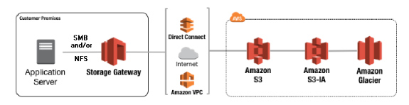
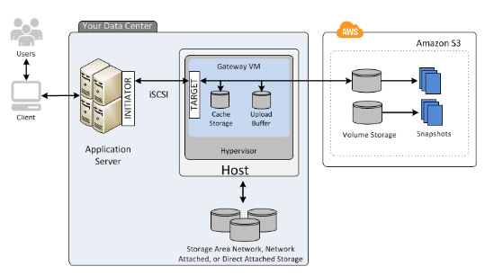
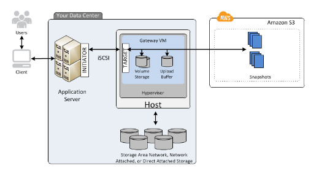

# AWS Storage Gateway

- The service enables **hybrid storage** between on-premises environments and the AWS Cloud.
- It integrates on-premises enterprise applications and workflows with  Amazon’s block and object cloud storage services through industry  standard storage protocols.
- The service stores files as native S3 objects, archives virtual tapes in  Amazon Glacier, and stores EBS Snapshots generated by the Volume Gateway with Amazon EBS.

### Storage Solutions

- **File Gateway** – supports a file interface into S3 and combines a service and a virtual software appliance. 
  - The software appliance, or gateway, is deployed into your on-premises  environment as a virtual machine running on VMware ESXi or Microsoft  Hyper-V hypervisor. 
  - File gateway supports 
    - S3 Standard
    - S3 Standard – Infrequent Access
    - S3 One Zone – IA 
  - With a file gateway, you can do the following:
    - You can store and retrieve files directly using the NFS version 3 or 4.1 protocol.
    - You can store and retrieve files directly using the SMB file system version, 2 and 3 protocol.
    - You can access your data directly in S3 from any AWS Cloud application or service.
    - You can manage your S3 data using lifecycle policies, cross-region replication, and versioning.
  - File Gateway now supports Amazon S3 Object Lock, enabling  write-once-read-many (WORM) file-based systems to store and access  objects in Amazon S3.
  - Any modifications such as file edits, deletes or renames from the gateway’s NFS or SMB clients are stored as new versions of the object, without  overwriting or deleting previous versions.

- **Volume Gateway** – provides cloud-backed storage volumes that you can mount as iSCSI devices from your on-premises application servers.

  - **Cached volumes** – you store your data in S3 and retain a copy of frequently accessed  data subsets locally. Cached volumes can range from 1 GiB to 32 TiB in size and must be rounded to the nearest GiB. Each gateway configured for cached volumes can support up to 32 volumes.

     

  - **Stored volumes** – if you need low-latency access to your entire dataset, first  configure your on-premises gateway to store all your data locally. Then  asynchronously back up point-in-time snapshots of this data to S3.  Stored volumes can range from 1 GiB to 16 TiB in size and must be  rounded to the nearest GiB. Each gateway configured for stored volumes  can support up to 32 volumes.

    

  - AWS Storage Gateway customers using the Volume Gateway configuration for block storage can detach and attach volumes, from and to a Volume  Gateway. You can use this feature to migrate volumes between gateways to refresh underlying server hardware, switch between virtual machine  types, and move volumes to better host platforms or newer Amazon EC2  instances.

- **Tape Gateway** – archive backup data in Amazon Glacier.

  - Has a virtual tape library (VTL) interface to store data on virtual tape cartridges that you create.
  - Deploy your gateway on an EC2 instance to provision iSCSI storage volumes in AWS.
  - The AWS Storage Gateway service integrates Tape Gateway with Amazon S3  Glacier Deep Archive storage class, allowing you to store virtual tapes  in the lowest-cost Amazon S3 storage class.
  - Tape Gateway also has the capability to move your virtual tapes archived in  Amazon S3 Glacier to Amazon S3 Glacier Deep Archive storage class,  enabling you to further reduce the monthly cost to store long-term data  in the cloud by up to 75%.

### Storage Gateway Hosting Options

- As a VM containing the Storage Gateway software, run on VMware ESXi, Microsoft Hyper-V on premises
- As a VM in VMware Cloud on AWS
- As a hardware appliance on premises
- As an AMI in an EC2 instance

- Storage Gateway stores volume, snapshot, tape, and file data in the AWS Region in which your gateway is activated. File data is stored in the AWS  Region where your S3 bucket is located.
- The local gateway appliance maintains a cache of recently written or read data so your applications can have low-latency access to data that is  stored durably in AWS. The gateways use a **read-through and write-back** cache.

### File Gateway File Share

- You can create an NFS or SMB file share using the AWS Management Console or service API.
- After your file gateway is activated and running, you can add additional file shares and grant access to S3 buckets.
- You can use a file share to access objects in an S3 bucket that belongs to a different AWS account.
- The AWS Storage Gateway service added support for Access Control Lists  (ACLs) to Server Message Block (SMB) shares on the File Gateway, helping enforce data security standards when using the gateway for storing and  accessing data in Amazon Simple Storage Service (S3).

### Security

- You can use AWS KMS to encrypt data written to a virtual tape. 
- Storage Gateway uses Challenge-Handshake Authentication Protocol (CHAP) to authenticate iSCSI and initiator connections. CHAP provides protection against playback attacks by requiring authentication to access storage  volume targets.
- Authentication and access control with IAM.

### Compliance

- Storage Gateway is HIPAA eligible.
- Storage Gateway in compliance with the Payment Card Industry Data Security Standard (PCI DSS)

### Pricing

- You are charged based on the type and amount of storage you use, the  requests you make, and the amount of data transferred out of AWS.
- You are charged only for the amount of data you write to the Tape Gateway tape, not the tape capacity.

### Limits

- For File Shares

| **Description**                                              | **File Gateway** |
| ------------------------------------------------------------ | ---------------- |
| Maximum number of file shares per Amazon S3 bucket. There is a one-to-one mapping between a file share and an S3 bucket | 1                |
| Maximum number of file shares per gateway                    | 10               |
| The maximum size of an individual file, which is the maximum size of an individual object in S3 | 5 TB             |

- For Volumes

| **Description**                         | **Cached Volumes** | **Stored Volumes** |
| --------------------------------------- | ------------------ | ------------------ |
| Maximum size of a volume                | 32 TiB             | 16 TiB             |
| Maximum number of volumes per gateway   | 32                 | 32                 |
| Total size of all volumes for a gateway | 1,024 TiB          | 512 TiB            |

- For Tapes

| **Description**                            | **Tape Gateway** |
| ------------------------------------------ | ---------------- |
| Minimum size of a virtual tape             | 100 GiB          |
| Maximum size of a virtual tape             | 2.5 TiB          |
| Maximum number of virtual tapes for a VTL  | 1,500            |
| Total size of all tapes in a VTL           | 1 PiB            |
| Maximum number of virtual tapes in archive | No limit         |
| Total size of all tapes in a archive       | No limit         |

 

#### Deep Dive: Hybrid Cloud Storage Architecture w/Storage Gateway:

https://youtu.be/o6TpM-FWs38

#### Sources

* https://docs.aws.amazon.com/storagegateway/latest/userguide/
* https://aws.amazon.com/storagegateway/features/
* https://aws.amazon.com/storagegateway/pricing/
* https://aws.amazon.com/storagegateway/faqs/